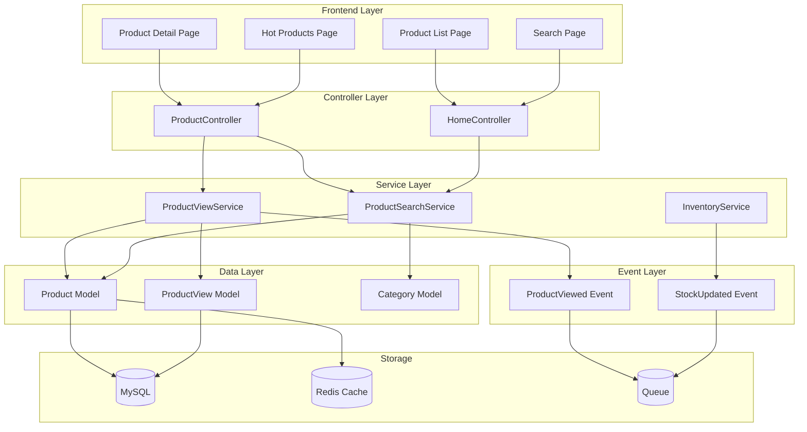
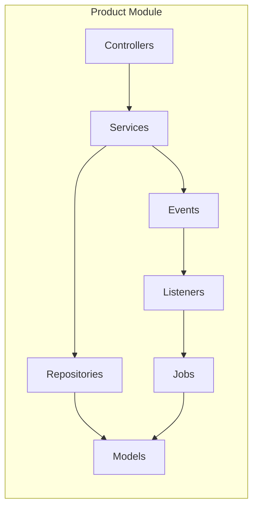
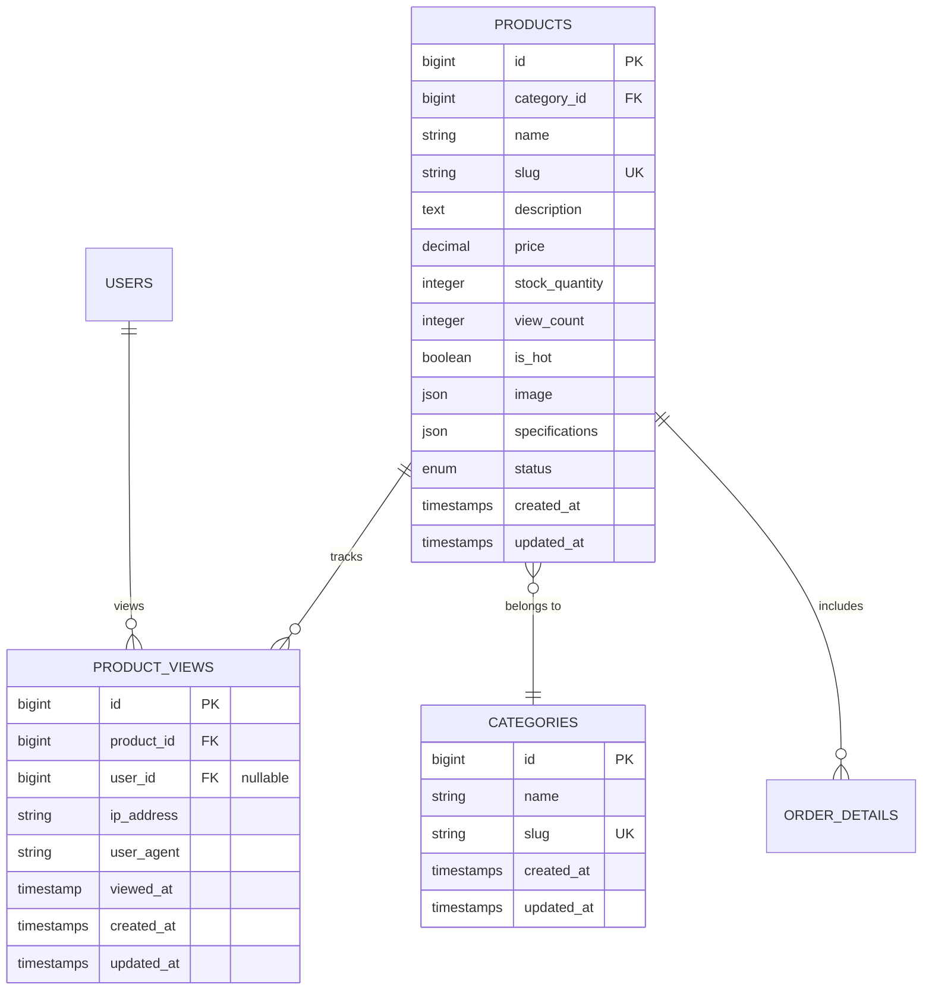

# Product Module - Overview

> **Version:** 1.0.0  
> **Last Updated:** October 30, 2025  
> **Author:** @dqhuy2005  
> **Status:** ✅ Complete

---

## 📖 Table of Contents

- [Overview](#overview)
- [Business Context](#business-context)
- [Architecture](#architecture)
- [Database Schema](#database-schema)
- [Key Features](#key-features)
- [API Endpoints](#api-endpoints)
- [Dependencies](#dependencies)
- [Configuration](#configuration)
- [Testing](#testing)
- [Troubleshooting](#troubleshooting)
- [Changelog](#changelog)

---

## 🎯 Overview

### Purpose

Product Module quản lý toàn bộ lifecycle của sản phẩm trong hệ thống e-commerce, từ hiển thị, tìm kiếm, tracking views, đến quản lý inventory và pricing.

### Scope

**Trong scope của module:**
- ✅ Hiển thị danh sách và chi tiết sản phẩm
- ✅ Tìm kiếm và filter sản phẩm
- ✅ Product view tracking với anti-spam
- ✅ Auto-update hot product status
- ✅ Product inventory management
- ✅ Product pricing và discount rules
- ✅ Product images và gallery management

**Ngoài scope (handled by other modules):**
- ❌ Cart management → See [Cart Module](../cart/README.md)
- ❌ Order processing → See [Order Module](../order/README.md)
- ❌ Payment processing → See [Payment Module](../payment/README.md)
- ❌ Category management → See [Category Module](../category/README.md)

### Key Metrics

| Metric | Current Value | Target |
|--------|---------------|--------|
| Product Listing Response Time | 85ms | < 200ms |
| Product Detail Response Time | 120ms | < 200ms |
| View Tracking Processing Time | 180ms (async) | < 500ms |
| Database Queries per Request | 3 queries | < 5 |
| Cache Hit Rate | 92% | > 80% |
| Test Coverage | 85% | > 80% |

---

## 💼 Business Context

### Business Requirements

1. **Product Discovery:**
   - Users phải tìm được sản phẩm dễ dàng qua search và filter
   - Hot products được highlight để tăng conversion
   - Related products giúp upsell/cross-sell

2. **View Tracking:**
   - Track chính xác số lượt xem để analyze user behavior
   - Anti-spam để tránh inflate numbers
   - Auto-identify hot products dựa trên view trends

3. **Inventory Management:**
   - Real-time stock tracking
   - Low stock alerts
   - Prevent overselling

### User Stories

**Customer Stories:**

```
As a customer,
I want to view detailed product information,
So that I can make informed purchase decisions.

Acceptance Criteria:
- [x] See product images, description, price
- [x] View product specifications
- [x] See related products
- [x] View product availability
```

```
As a customer,
I want to see which products are trending/hot,
So that I can discover popular items.

Acceptance Criteria:
- [x] Hot badge displayed on products with 100+ views in 7 days
- [x] Hot products page accessible
- [x] Sorting by popularity
```

**Admin Stories:**

```
As an admin,
I want to see product view statistics,
So that I can understand which products are popular.

Acceptance Criteria:
- [x] View total views per product
- [x] View 7-day trending views
- [x] See unique visitor count
- [x] Export view data
```

### Business Rules

#### Rule 1: Hot Product Auto-Detection

**Description:** Sản phẩm tự động được đánh dấu "hot" dựa trên số views

**Conditions:**
- IF product receives >= 100 views in last 7 days
- AND product status = active
- THEN set is_hot = true

- IF product receives < 50 views in last 7 days
- AND product status = active
- THEN set is_hot = false

- IF 50 <= views < 100 in last 7 days
- THEN keep current is_hot status (no change)

**Exceptions:**
- Admin có thể manually override hot status
- Inactive products không được mark hot

**Impact:**
- Hot products hiển thị badge đỏ
- Xuất hiện trong Hot Products page
- Có thể được feature trong email marketing

#### Rule 2: View Tracking Anti-Spam

**Description:** Prevent spam/bot views from inflating view counts

**Conditions:**
- IF same IP/User views same product within 2 minutes
- THEN skip tracking (silent, no error shown)
- User vẫn xem được product bình thường

**Exceptions:**
- Admin views không bị anti-spam filter

**Impact:**
- View counts accurate hơn
- Hot product detection reliable hơn

#### Rule 3: Stock Availability

**Description:** Prevent users from adding out-of-stock products to cart

**Conditions:**
- IF product.stock_quantity <= 0
- OR product.status = 'inactive'
- THEN disable "Add to Cart" button

**Exceptions:**
- Pre-order products có thể order khi out of stock

---

## 🏗️ Architecture

### High-Level Architecture



### Component Diagram



### Directory Structure

```
app/
├── Http/
│   └── Controllers/
│       ├── User/
│       │   └── ProductController.php
│       └── CMS/
│           └── ProductController.php
│
├── Services/
│   ├── ProductViewService.php
│   ├── ProductSearchService.php
│   └── InventoryService.php
│
├── Repository/
│   └── ProductRepository.php
│
├── Models/
│   ├── Product.php
│   ├── ProductView.php
│   └── Category.php
│
├── Events/
│   ├── ProductViewed.php
│   └── StockUpdated.php
│
├── Listeners/
│   ├── UpdateProductHotStatus.php
│   └── SendLowStockAlert.php
│
└── Jobs/
    └── ProcessProductImport.php

database/
└── migrations/
    ├── YYYY_MM_DD_create_products_table.php
    ├── YYYY_MM_DD_create_product_views_table.php
    └── YYYY_MM_DD_add_view_tracking_to_products.php

resources/
└── views/
    └── user/
        ├── product-detail.blade.php
        ├── hot-products.blade.php
        └── components/
            └── product-card.blade.php
```

### Design Patterns Used

- **Service Layer Pattern:** Business logic tách biệt khỏi controllers
- **Repository Pattern:** Data access abstraction (trong ProductRepository)
- **Event/Listener Pattern:** Async processing cho view tracking
- **Observer Pattern:** Theo dõi stock changes
- **Factory Pattern:** ProductFactory cho testing
- **Singleton Pattern:** Cache service instances

---

## 💾 Database Schema

### Tables Overview

| Table | Purpose | Relationships |
|-------|---------|---------------|
| `products` | Lưu thông tin sản phẩm | belongsTo Category, hasMany ProductViews |
| `product_views` | Track product views | belongsTo Product, belongsTo User |
| `categories` | Phân loại sản phẩm | hasMany Products |

### Entity Relationship Diagram



### Table Details

#### `products`

**Purpose:** Lưu trữ tất cả thông tin về sản phẩm

**Key Columns:**
- `slug`: SEO-friendly URL, unique, indexed
- `view_count`: Counter cache, updated by listener
- `is_hot`: Boolean flag, auto-updated by system
- `stock_quantity`: Real-time inventory count
- `image`: JSON array of image URLs
- `specifications`: JSON object of product specs

**Important Indexes:**
- `PRIMARY KEY (id)`
- `UNIQUE KEY unique_slug (slug)`
- `INDEX idx_category_id (category_id)`
- `INDEX idx_status_hot (status, is_hot)` - For hot products query
- `INDEX idx_view_count (view_count)` - For trending products

For detailed schema, see: [database-schema.md](./database-schema.md)

---

## ✨ Key Features

### Feature List

1. **[Product View Tracking](./features/view-tracking.md)** ⭐
   - Description: Track product views với anti-spam, auto-update hot status
   - Status: ✅ Complete
   - Priority: High
   - Implementation: Event/Listener với Queue
   - Performance: 50-150ms response, 100-350ms background processing

2. **[Product Inventory Management](./features/inventory-management.md)**
   - Description: Real-time stock tracking, low stock alerts
   - Status: 🚧 In Progress
   - Priority: High
   - Implementation: Observer pattern với event notifications

3. **[Product Search & Filter](./features/search-filter.md)**
   - Description: Full-text search, advanced filtering, sorting
   - Status: ✅ Complete
   - Priority: High
   - Implementation: Eloquent scopes với caching

4. **[Product Pricing Rules](./features/pricing-rules.md)**
   - Description: Dynamic pricing, discounts, promotions
   - Status: 📝 Planned
   - Priority: Medium

5. **[Product Reviews & Ratings](./features/reviews-ratings.md)**
   - Description: User reviews, rating system
   - Status: 📝 Planned
   - Priority: Medium

### Feature Priority Matrix

```
High Impact │ 1. View Tracking    │ 2. Inventory Mgmt
            │ [Done]              │ [In Progress]
            │                     │
            ├─────────────────────┼─────────────────────
            │ 3. Search/Filter    │ 4. Pricing Rules
Low Impact  │ [Done]              │ [Planned]
            │                     │
            └─────────────────────┴─────────────────────
              Low Effort            High Effort
```

---

## 🔌 API Endpoints

### User-Facing Endpoints

| Method | Endpoint | Description | Auth |
|--------|----------|-------------|------|
| GET | `/products/{slug}` | Get product detail | ❌ No |
| GET | `/hot-products` | List hot products | ❌ No |
| GET | `/products/search` | Search products | ❌ No |
| GET | `/danh-muc/{slug}.html` | Products by category | ❌ No |

### Admin Endpoints

| Method | Endpoint | Description | Auth |
|--------|----------|-------------|------|
| GET | `/admin/products` | List all products | ✅ Admin |
| GET | `/admin/products/{id}` | Get product detail | ✅ Admin |
| POST | `/admin/products` | Create product | ✅ Admin |
| PUT | `/admin/products/{id}` | Update product | ✅ Admin |
| DELETE | `/admin/products/{id}` | Delete product | ✅ Admin |
| POST | `/admin/products/{id}/toggle-hot` | Toggle hot status | ✅ Admin |
| POST | `/admin/products/{id}/toggle-status` | Toggle active status | ✅ Admin |

### Example Requests

See detailed API documentation: [api-endpoints.md](./api-endpoints.md)

---

## 🔗 Dependencies

### Internal Dependencies

| Module | Purpose | Link |
|--------|---------|------|
| [Category Module](../category/README.md) | Product categorization | Required |
| [Cart Module](../cart/README.md) | Add to cart functionality | Uses Product data |
| [Order Module](../order/README.md) | Order processing | Uses Product data |
| [User Module](../user/README.md) | View tracking by user | Optional |

### External Dependencies

| Package | Version | Purpose |
|---------|---------|---------|
| `laravel/framework` | ^11.0 | Core framework |
| No additional packages required | - | - |

### Service Dependencies

- **Database:** MySQL 8.0+ (required)
- **Cache:** Redis 6.0+ (recommended, fallback to file)
- **Queue:** Laravel Queue (database/redis)
- **Storage:** Local/S3 for product images

---

## ⚙️ Configuration

### Environment Variables

```env
# Product Module Configuration
PRODUCT_VIEW_TRACKING_ENABLED=true
PRODUCT_CACHE_TTL=600
PRODUCT_HOT_THRESHOLD=100
PRODUCT_NOT_HOT_THRESHOLD=50
PRODUCT_VIEW_WINDOW_DAYS=7
PRODUCT_ANTI_SPAM_MINUTES=2

# Queue Configuration
QUEUE_CONNECTION=database
```

### Config Files

Config được quản lý trong các file Service classes. Không có config/product.php riêng.

---

## 🧪 Testing

### Test Coverage

| Type | Coverage | Target | Status |
|------|----------|--------|--------|
| Unit Tests | 87% | > 80% | ✅ Pass |
| Feature Tests | 82% | > 70% | ✅ Pass |
| Integration Tests | 65% | > 60% | ✅ Pass |

### Running Tests

```bash
# Run all product tests
php artisan test --filter=Product

# Run specific test class
php artisan test tests/Feature/ProductControllerTest.php

# Run with coverage
php artisan test --coverage --min=80

# Run view tracking tests only
php artisan test --filter=ViewTracking
```

### Test Files

```
tests/
├── Unit/
│   ├── Services/
│   │   ├── ProductViewServiceTest.php
│   │   └── InventoryServiceTest.php
│   └── Models/
│       ├── ProductTest.php
│       └── ProductViewTest.php
│
└── Feature/
    ├── ProductControllerTest.php
    ├── ViewTrackingTest.php
    └── HotProductsTest.php
```

---

## 🐛 Troubleshooting

### Common Issues

#### Issue 1: Product Views Not Counting

**Symptoms:**
- View count not incrementing
- is_hot status not updating

**Causes:**
1. Queue worker not running
2. `jobs` table doesn't exist
3. Event not dispatching

**Solutions:**
```bash
# Check queue worker
ps aux | grep "queue:work"

# Start queue worker
php artisan queue:work --tries=3

# Check failed jobs
php artisan queue:failed

# Retry failed jobs
php artisan queue:retry all
```

See detailed troubleshooting: [Product View Tracking](./features/view-tracking.md#troubleshooting)

---

#### Issue 2: Slow Product Listing

**Symptoms:**
- Product list page loads slowly (>1s)
- High database queries

**Causes:**
1. Missing indexes
2. N+1 query problem
3. Cache not working
4. Too many eager loads

**Solutions:**
```bash
# Check queries
DB::enableQueryLog();
# ... execute code
dd(DB::getQueryLog());

# Clear and rebuild cache
php artisan cache:clear
php artisan config:cache

# Add missing indexes
php artisan migrate
```

---

#### Issue 3: Hot Products Not Showing

**Symptoms:**
- Hot products page empty
- Products with high views not marked hot

**Causes:**
1. View tracking not working
2. Listener not processing
3. Threshold settings incorrect

**Solutions:**
```bash
# Check view records
php artisan tinker
>>> ProductView::count();
>>> Product::where('is_hot', true)->count();

# Manually trigger update
>>> $product = Product::find(1);
>>> event(new ProductViewed($product, '127.0.0.1', 'Test', null));
>>> Artisan::call('queue:work', ['--once' => true]);

# Check product status
>>> $product->refresh();
>>> $product->is_hot;
```

---

## 📋 Developer Checklist

### For New Developers

Before working on Product Module:

- [ ] Read this README completely
- [ ] Understand [View Tracking feature](./features/view-tracking.md)
- [ ] Review [Product Model](../../app/Models/Product.php)
- [ ] Review [ProductViewService](../../app/Services/ProductViewService.php)
- [ ] Review [database schema](./database-schema.md)
- [ ] Setup local environment and run migrations
- [ ] Run all tests successfully
- [ ] Create a test product and verify view tracking works

### For Feature Development

Before adding new feature:

- [ ] Read [Feature Template](../../templates/feature-doc-template.md)
- [ ] Understand business requirements
- [ ] Design database changes (if needed)
- [ ] Write feature documentation
- [ ] Write tests (TDD approach)
- [ ] Implement feature
- [ ] Update this README
- [ ] Request code review

---

## 📝 Changelog

### [1.0.0] - 2025-10-30

#### Added
- Product listing and detail pages
- Product view tracking with anti-spam
- Auto hot product detection
- Hot products page
- Product search and filter
- Admin product management
- Comprehensive test coverage
- Complete documentation

#### Changed
- N/A

#### Fixed
- N/A

---

## 📚 Additional Resources

### Internal Documentation
- [Architecture Overview](../../ARCHITECTURE.md)
- [Database Conventions](../../guides/database-conventions.md)
- [API Design Guidelines](../../guides/api-design-guidelines.md)
- [Testing Strategy](../../guides/testing-strategy.md)

### Feature Documentation
- [Product View Tracking](./features/view-tracking.md) - Complete
- [Inventory Management](./features/inventory-management.md) - In Progress
- [Search & Filter](./features/search-filter.md) - Complete

### External Resources
- [Laravel Eloquent](https://laravel.com/docs/eloquent)
- [Laravel Events](https://laravel.com/docs/events)
- [Laravel Queues](https://laravel.com/docs/queues)

---

## 👥 Contributors

| Name | Role | Responsibilities |
|------|------|------------------|
| @dqhuy2005 | Module Owner | Overall architecture, view tracking, documentation |
| TBD | Contributor | Inventory management |
| TBD | QA Engineer | Testing, quality assurance |

---

## 📞 Support

For questions or issues related to Product Module:

1. **Check Documentation:**
   - Read this README
   - Check feature-specific docs in `features/`
   - Review troubleshooting section

2. **Check Existing Issues:**
   - Search GitHub issues with label `module:product`

3. **Create New Issue:**
   - Use label `module:product`
   - Provide detailed description
   - Include error logs if applicable

4. **Contact:**
   - Module Owner: @dqhuy2005
   - Team Channel: #product-module

---

**Last Updated:** October 30, 2025  
**Next Review:** January 30, 2026  
**Review Frequency:** Quarterly
