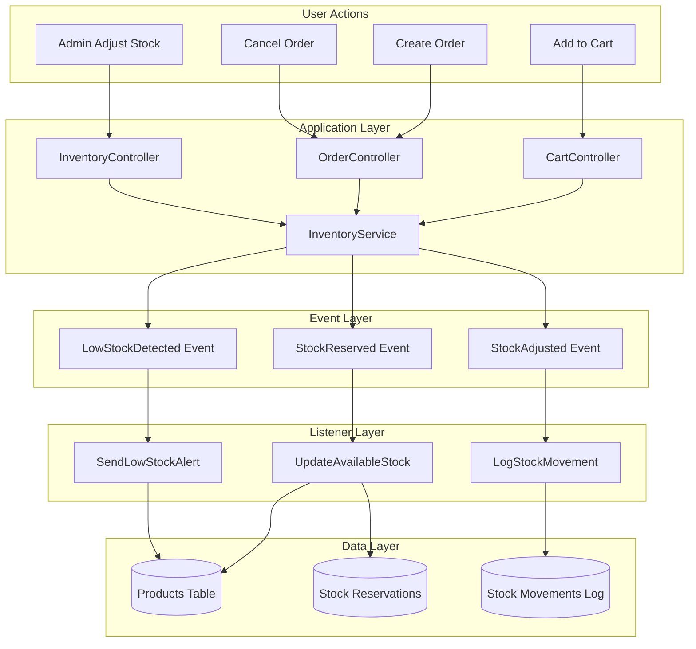
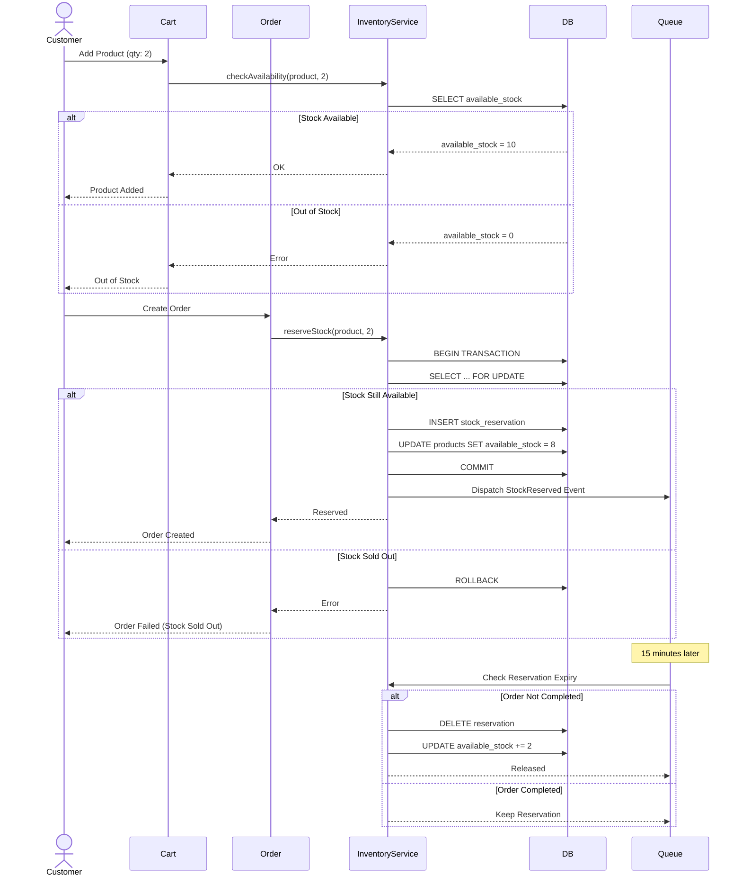

# Product Inventory Management

> **Version:** 0.5.0  
> **Last Updated:** October 30, 2025  
> **Author:** @dqhuy2005  
> **Status:** 🚧 In Progress (Planning Phase)  
> **Module:** [Product Module](../README.md)

---

## 📖 Table of Contents

1. [Overview](#overview)
2. [Business Requirements](#business-requirements)
3. [Technical Architecture](#technical-architecture)
4. [Implementation Plan](#implementation-plan)
5. [Database Schema](#database-schema)
6. [API Specification](#api-specification)
7. [Testing Strategy](#testing-strategy)
8. [Rollout Plan](#rollout-plan)

---

## 🎯 Overview

### What is Inventory Management?

Hệ thống quản lý tồn kho real-time cho products, tracking stock levels, preventing overselling, và alert khi stock thấp.

### Current Status: Planning Phase 🚧

**What's Done:**
- ✅ Basic `stock_quantity` field in products table
- ✅ Simple stock check in cart system

**What's Missing:**
- ❌ Stock history tracking
- ❌ Low stock alerts
- ❌ Reserved stock for pending orders
- ❌ Multi-warehouse support
- ❌ Stock audit logs

### Business Value

| Problem | Solution | Impact |
|---------|----------|--------|
| **Overselling** | Reserve stock on order | Prevent customer disappointment |
| **Stock Blindness** | Real-time tracking | Always know inventory status |
| **Reorder Delays** | Low stock alerts | Proactive restocking |
| **Audit Trail Missing** | Stock movement logs | Compliance & troubleshooting |
| **Manual Tracking** | Automated system | Save time, reduce errors |

---

## 💼 Business Requirements

### User Stories

**Story 1: Prevent Overselling**
```
As a store owner,
I want stock reserved when customers start checkout,
So that we never sell more than we have.

Acceptance Criteria:
- [ ] Stock reserved when order created
- [ ] Stock released if order cancelled/expired
- [ ] Reserved stock not available for new orders
- [ ] Handle race conditions (concurrent checkouts)
```

**Story 2: Low Stock Alerts**
```
As a store owner,
I want to be notified when product stock is low,
So that I can reorder before running out.

Acceptance Criteria:
- [ ] Configurable low stock threshold per product
- [ ] Email alert when threshold reached
- [ ] Dashboard showing low stock products
- [ ] Alert only once until restocked
```

**Story 3: Stock History**
```
As a store manager,
I want to see stock movement history,
So that I can audit and troubleshoot discrepancies.

Acceptance Criteria:
- [ ] Log all stock changes (in, out, adjustment)
- [ ] Include reason, user, timestamp
- [ ] Filter by product, date range, type
- [ ] Export to Excel for accounting
```

### Business Rules

#### Rule 1: Stock Reservation

```
WHEN customer creates order:
  IF product.available_stock >= order_quantity:
    CREATE stock_reservation
    SET reserved_until = now() + 15 minutes
    UPDATE product.available_stock
  ELSE:
    REJECT order (out of stock)

WHEN order completed:
  DEDUCT from actual stock
  DELETE stock_reservation

WHEN order cancelled OR reservation expires:
  RELEASE reserved stock
  DELETE stock_reservation
```

#### Rule 2: Low Stock Alert

```
WHEN stock_quantity <= low_stock_threshold:
  IF NOT already_alerted_today:
    SEND email to inventory_manager
    LOG alert in system
    SET last_alert_date = today

WHEN stock restocked:
  RESET alert flag
  ALLOW new alerts
```

#### Rule 3: Stock Adjustment

```
WHO can adjust stock:
  - Admin: Full access
  - Warehouse Manager: Add/Remove stock
  - System: Auto-deduct on sales

WHEN stock adjusted manually:
  REQUIRE reason (dropdown + text)
  LOG user, timestamp, old value, new value
  SEND notification if adjustment > 10 units
```

---

## 🏗️ Technical Architecture

### High-Level Design



### Stock Reservation Flow



---

## 💾 Database Schema

### New Tables

#### 1. stock_reservations

```sql
CREATE TABLE `stock_reservations` (
  `id` bigint unsigned NOT NULL AUTO_INCREMENT,
  `product_id` bigint unsigned NOT NULL,
  `order_id` bigint unsigned NOT NULL,
  `quantity` int unsigned NOT NULL,
  `reserved_at` timestamp NOT NULL DEFAULT CURRENT_TIMESTAMP,
  `expires_at` timestamp NOT NULL,
  `status` enum('active','expired','fulfilled','cancelled') NOT NULL DEFAULT 'active',
  `created_at` timestamp NULL DEFAULT NULL,
  `updated_at` timestamp NULL DEFAULT NULL,
  
  PRIMARY KEY (`id`),
  KEY `idx_product_status` (`product_id`, `status`),
  KEY `idx_order` (`order_id`),
  KEY `idx_expires_at` (`expires_at`),
  
  CONSTRAINT `fk_stock_reservations_product` 
    FOREIGN KEY (`product_id`) REFERENCES `products` (`id`) ON DELETE CASCADE,
  CONSTRAINT `fk_stock_reservations_order` 
    FOREIGN KEY (`order_id`) REFERENCES `orders` (`id`) ON DELETE CASCADE
) ENGINE=InnoDB DEFAULT CHARSET=utf8mb4;
```

**Purpose:** Track temporary stock holds during checkout process

**Key Fields:**
- `expires_at` - Auto-release after 15 minutes if order not completed
- `status` - Track reservation lifecycle

---

#### 2. stock_movements

```sql
CREATE TABLE `stock_movements` (
  `id` bigint unsigned NOT NULL AUTO_INCREMENT,
  `product_id` bigint unsigned NOT NULL,
  `type` enum('in','out','adjustment','return','damage') NOT NULL,
  `quantity` int NOT NULL,  -- Negative for 'out', positive for 'in'
  `stock_before` int unsigned NOT NULL,
  `stock_after` int unsigned NOT NULL,
  `reason` varchar(255) NOT NULL,
  `reference_type` varchar(50) NULL,  -- 'order', 'purchase', 'manual', etc.
  `reference_id` bigint unsigned NULL,
  `performed_by` bigint unsigned NULL,
  `notes` text NULL,
  `created_at` timestamp NULL DEFAULT NULL,
  
  PRIMARY KEY (`id`),
  KEY `idx_product_created` (`product_id`, `created_at`),
  KEY `idx_type` (`type`),
  KEY `idx_reference` (`reference_type`, `reference_id`),
  
  CONSTRAINT `fk_stock_movements_product` 
    FOREIGN KEY (`product_id`) REFERENCES `products` (`id`) ON DELETE CASCADE,
  CONSTRAINT `fk_stock_movements_user` 
    FOREIGN KEY (`performed_by`) REFERENCES `users` (`id`) ON DELETE SET NULL
) ENGINE=InnoDB DEFAULT CHARSET=utf8mb4;
```

**Purpose:** Complete audit trail of all stock changes

**Key Fields:**
- `type` - Category of movement
- `stock_before` & `stock_after` - For verification
- `reference_type` & `reference_id` - Link to source (order, etc.)
- `performed_by` - Accountability

---

### Updated Tables

#### products (add new columns)

```sql
ALTER TABLE `products`
ADD COLUMN `stock_quantity` int unsigned NOT NULL DEFAULT 0,
ADD COLUMN `reserved_stock` int unsigned NOT NULL DEFAULT 0,
ADD COLUMN `available_stock` int unsigned GENERATED ALWAYS AS (`stock_quantity` - `reserved_stock`) STORED,
ADD COLUMN `low_stock_threshold` int unsigned DEFAULT 10,
ADD COLUMN `last_low_stock_alert` timestamp NULL,
ADD INDEX `idx_available_stock` (`available_stock`);
```

**Key Columns:**
- `stock_quantity` - Actual physical stock
- `reserved_stock` - Temporary holds (pending orders)
- `available_stock` - **Computed column** = stock_quantity - reserved_stock
- `low_stock_threshold` - Configurable per product

---

## 💻 Implementation Plan

### Phase 1: Core Inventory Service (Week 1-2)

**Tasks:**
- [ ] Create `InventoryService` class
- [ ] Implement `checkAvailability()` method
- [ ] Implement `reserveStock()` with transaction
- [ ] Implement `releaseStock()` method
- [ ] Implement `deductStock()` for completed orders
- [ ] Add unit tests (>80% coverage)

**Files to Create:**
```
app/Services/InventoryService.php
app/Exceptions/InsufficientStockException.php
tests/Unit/Services/InventoryServiceTest.php
```

---

### Phase 2: Stock Reservation System (Week 3)

**Tasks:**
- [ ] Create `StockReservation` model
- [ ] Implement reservation lifecycle
- [ ] Create scheduled job to release expired reservations
- [ ] Integrate with `OrderController`
- [ ] Add feature tests

**Files to Create:**
```
app/Models/StockReservation.php
app/Jobs/ReleaseExpiredReservations.php
app/Events/StockReserved.php
app/Listeners/UpdateReservedStock.php
tests/Feature/StockReservationTest.php
```

---

### Phase 3: Stock Movement Logging (Week 4)

**Tasks:**
- [ ] Create `StockMovement` model
- [ ] Create `LogStockMovement` observer
- [ ] Log all stock changes automatically
- [ ] Create admin UI to view logs
- [ ] Export functionality

**Files to Create:**
```
app/Models/StockMovement.php
app/Observers/StockMovementObserver.php
app/Http/Controllers/Admin/StockMovementController.php
resources/views/admin/stock-movements/index.blade.php
```

---

### Phase 4: Low Stock Alerts (Week 5)

**Tasks:**
- [ ] Create `LowStockDetected` event
- [ ] Create `SendLowStockAlert` listener
- [ ] Email notification template
- [ ] Admin dashboard widget
- [ ] Alert management (snooze, dismiss)

**Files to Create:**
```
app/Events/LowStockDetected.php
app/Listeners/SendLowStockAlert.php
app/Mail/LowStockAlertMail.php
resources/views/emails/low-stock-alert.blade.php
```

---

### Phase 5: Admin UI & Reports (Week 6)

**Tasks:**
- [ ] Inventory dashboard
- [ ] Manual stock adjustment form
- [ ] Stock movement reports
- [ ] Low stock products page
- [ ] Export to Excel

**Files to Create:**
```
app/Http/Controllers/Admin/InventoryController.php
resources/views/admin/inventory/dashboard.blade.php
resources/views/admin/inventory/adjust.blade.php
resources/views/admin/inventory/reports.blade.php
```

---

## 🔌 API Specification

### Service Methods

```php
namespace App\Services;

class InventoryService
{
    /**
     * Check if product has sufficient stock
     */
    public function checkAvailability(int $productId, int $quantity): bool;

    /**
     * Reserve stock for order (with expiry)
     */
    public function reserveStock(
        int $productId, 
        int $quantity, 
        int $orderId,
        int $expiryMinutes = 15
    ): StockReservation;

    /**
     * Release reserved stock (order cancelled/expired)
     */
    public function releaseReservation(int $reservationId): void;

    /**
     * Deduct stock (order completed)
     */
    public function deductStock(
        int $productId, 
        int $quantity, 
        int $orderId
    ): void;

    /**
     * Adjust stock manually (admin)
     */
    public function adjustStock(
        int $productId,
        int $newQuantity,
        string $reason,
        int $performedBy
    ): StockMovement;

    /**
     * Get stock movement history
     */
    public function getMovementHistory(
        int $productId,
        ?Carbon $startDate = null,
        ?Carbon $endDate = null
    ): Collection;

    /**
     * Get low stock products
     */
    public function getLowStockProducts(): Collection;
}
```

---

## 🧪 Testing Strategy

### Test Coverage Goals

| Component | Target Coverage |
|-----------|----------------|
| InventoryService | > 90% |
| StockReservation | > 85% |
| Stock Movements | > 80% |
| Listeners | > 75% |

### Critical Test Scenarios

#### Test 1: Race Condition - Concurrent Checkouts

```php
public function test_concurrent_checkouts_dont_oversell(): void
{
    $product = Product::factory()->create(['stock_quantity' => 10]);
    
    // Simulate 20 concurrent orders of 1 unit each
    $promises = [];
    for ($i = 0; $i < 20; $i++) {
        $promises[] = async(fn() => 
            $this->inventoryService->reserveStock($product->id, 1, $i)
        );
    }
    
    $results = await($promises);
    
    // Only 10 should succeed
    $successful = collect($results)->filter()->count();
    $this->assertEquals(10, $successful);
    
    // Stock should be fully reserved
    $product->refresh();
    $this->assertEquals(0, $product->available_stock);
}
```

#### Test 2: Reservation Expiry

```php
public function test_expired_reservations_release_stock(): void
{
    $product = Product::factory()->create(['stock_quantity' => 10]);
    
    // Reserve stock
    $reservation = $this->inventoryService->reserveStock(
        $product->id, 
        5, 
        orderId: 1,
        expiryMinutes: 1  // 1 minute for testing
    );
    
    // Stock should be reserved
    $product->refresh();
    $this->assertEquals(5, $product->available_stock);
    
    // Time travel 2 minutes
    $this->travel(2)->minutes();
    
    // Run scheduled job
    Artisan::call('schedule:run');
    
    // Stock should be released
    $product->refresh();
    $this->assertEquals(10, $product->available_stock);
    
    // Reservation should be expired
    $reservation->refresh();
    $this->assertEquals('expired', $reservation->status);
}
```

---

## 📋 Developer Checklist

### Before Starting Implementation

- [ ] Read this document completely
- [ ] Understand business rules and edge cases
- [ ] Review related modules (Order, Cart)
- [ ] Setup test database
- [ ] Read Laravel Transaction documentation

### During Implementation

- [ ] Write tests first (TDD)
- [ ] Use database transactions for stock operations
- [ ] Add proper error handling
- [ ] Log all critical operations
- [ ] Consider race conditions
- [ ] Optimize database queries

### Before Deployment

- [ ] All tests passing (>85% coverage)
- [ ] Load testing completed
- [ ] Migration rollback tested
- [ ] Documentation updated
- [ ] Code reviewed by senior dev
- [ ] Monitoring alerts configured

---

## 🚀 Rollout Plan

### Stage 1: Internal Testing (Week 7)
- Deploy to staging
- Manual testing by QA team
- Load testing (simulate 1000 concurrent users)
- Bug fixes

### Stage 2: Beta Testing (Week 8)
- Enable for 10% of users
- Monitor error rates
- Gather feedback
- Fix issues

### Stage 3: Full Release (Week 9)
- Enable for 100% of users
- Monitor closely for 48 hours
- Be ready to rollback

### Rollback Plan
- Keep old stock system as fallback
- Feature flag: `INVENTORY_V2_ENABLED=false`
- Can rollback within 5 minutes

---

## 📝 Open Questions

### To Discuss with Team:

1. **Reservation Expiry Time:**  
   - Current plan: 15 minutes
   - Should it be configurable per product category?

2. **Multi-Warehouse Support:**  
   - Phase 2 feature?
   - Or design for it now?

3. **Historical Data:**  
   - Keep stock movements forever?
   - Or archive after 2 years?

4. **Alert Frequency:**  
   - Once per day per product?
   - Or more aggressive?

5. **Stock Accuracy:**  
   - Periodic inventory audits?
   - Auto-sync with external systems?

---

## 📚 Related Documentation

- [Product Module Overview](../README.md)
- [Order Module](../../order/README.md)
- [Cart Module](../../cart/README.md)

---

**Status:** 🚧 Planning Phase  
**Next Review:** November 15, 2025  
**Questions?** Contact @dqhuy2005
