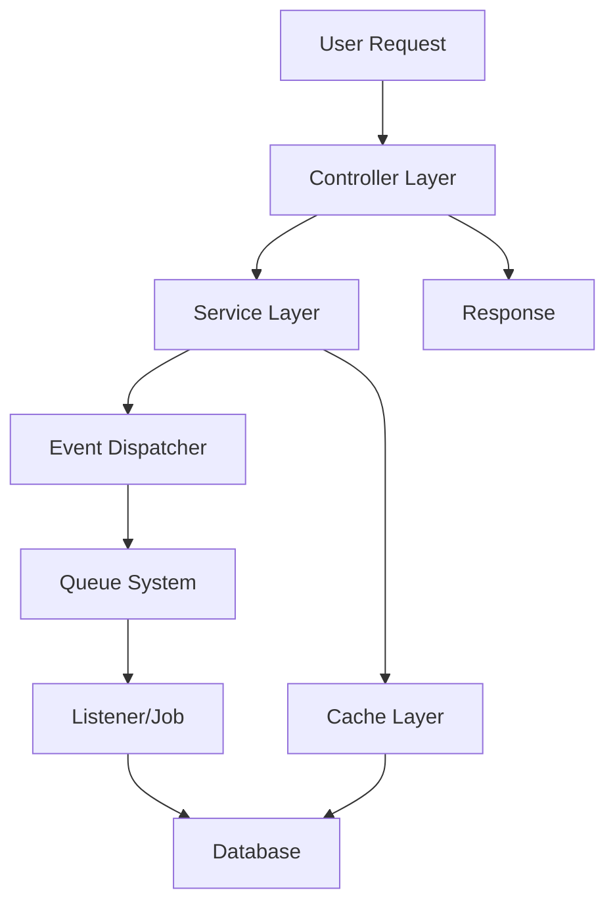
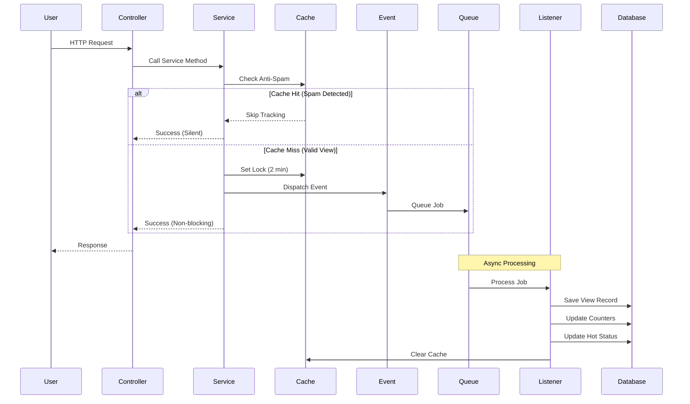
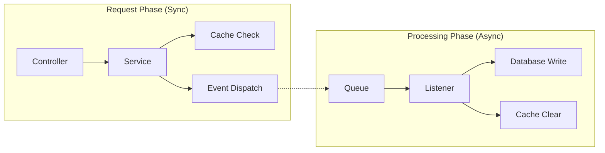
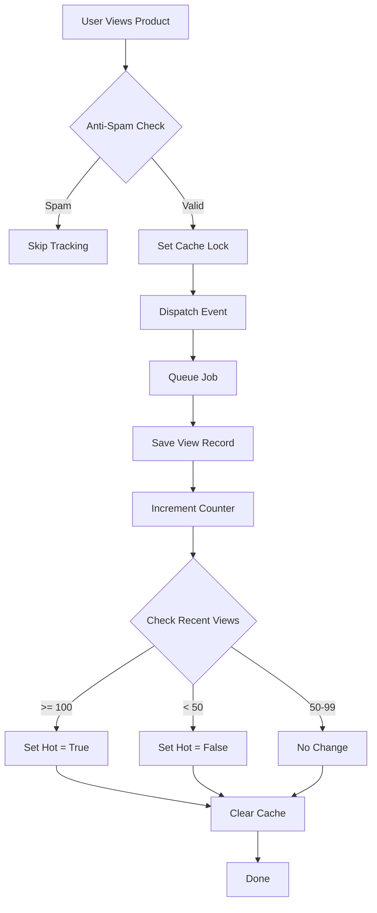
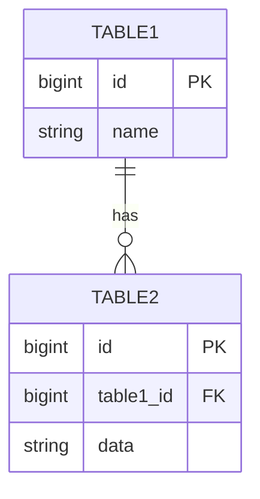

# [Feature Name]

> **Version:** 1.0.0  
> **Last Updated:** YYYY-MM-DD  
> **Author:** @username  
> **Status:** ✅ Complete / 🚧 In Progress / 📝 Planned  
> **Module:** [Parent Module](../README.md)

---

## 📖 Table of Contents

- [Overview](#overview)
- [Business Requirements](#business-requirements)
- [Technical Specification](#technical-specification)
- [Architecture & Flow](#architecture--flow)
- [Database Schema](#database-schema)
- [Implementation Details](#implementation-details)
- [API Documentation](#api-documentation)
- [Configuration](#configuration)
- [Error Handling](#error-handling)
- [Performance Considerations](#performance-considerations)
- [Testing](#testing)
- [Edge Cases](#edge-cases)
- [Monitoring & Logging](#monitoring--logging)
- [Troubleshooting](#troubleshooting)
- [Future Improvements](#future-improvements)
- [Changelog](#changelog)

---

## 🎯 Overview

### What is This Feature?

[2-3 câu mô tả feature này làm gì]

### Why Do We Need It?

[Giải thích business value và tại sao cần feature này]

### Key Benefits

- ✅ Benefit 1
- ✅ Benefit 2
- ✅ Benefit 3

### Quick Stats

| Metric | Value |
|--------|-------|
| Implementation Time | X days |
| Lines of Code | ~XXX |
| Test Coverage | XX% |
| Performance Impact | +/-X% |

---

## 💼 Business Requirements

### User Stories

```
As a [user type],
I want to [action],
So that [benefit].

Acceptance Criteria:
- [ ] Criterion 1
- [ ] Criterion 2
- [ ] Criterion 3
```

**Example:**
```
As a product manager,
I want to track product view counts automatically,
So that I can identify hot products and optimize inventory.

Acceptance Criteria:
- [ ] View count increments on each product page visit
- [ ] Duplicate views from same user/IP filtered (anti-spam)
- [ ] Products with 100+ views in 7 days marked as "hot"
- [ ] System handles 1000+ concurrent users
```

### Business Rules

#### Rule 1: [Rule Name]

**Description:** [Detailed description]

**Conditions:**
- IF condition 1
- AND condition 2
- THEN action

**Exceptions:**
- Exception case 1
- Exception case 2

**Example:**
```
IF product receives >= 100 views in 7 days
AND product is active
THEN set is_hot = true

Exception: Admin can manually override hot status
```

#### Rule 2: [Rule Name]

[Similar structure...]

### Stakeholders

| Role | Name | Requirements |
|------|------|--------------|
| Product Owner | @name | [Key requirements] |
| Marketing Team | @name | [Key requirements] |
| Dev Team | @name | [Technical constraints] |

---

## 🔧 Technical Specification

### Requirements

**Functional Requirements:**
- FR1: [Requirement description]
- FR2: [Requirement description]
- FR3: [Requirement description]

**Non-Functional Requirements:**
- NFR1: Performance - Response time < 200ms
- NFR2: Scalability - Handle 10,000 requests/min
- NFR3: Reliability - 99.9% uptime
- NFR4: Security - Data encryption at rest

### Technical Constraints

- ⚠️ Constraint 1: [Description and impact]
- ⚠️ Constraint 2: [Description and impact]

### Technology Stack

| Component | Technology | Version |
|-----------|------------|---------|
| Backend | Laravel | 11.x |
| Database | MySQL | 8.0+ |
| Cache | Redis | 6.0+ |
| Queue | Laravel Queue | - |

---

## 🏗️ Architecture & Flow

### High-Level Architecture



### Detailed Flow Diagram



### Component Interaction



### Data Flow



---

## 💾 Database Schema

### Tables Involved

#### `table_name`

**Purpose:** [Describe purpose]

```sql
CREATE TABLE table_name (
    id BIGINT UNSIGNED PRIMARY KEY AUTO_INCREMENT,
    column1 VARCHAR(255) NOT NULL,
    column2 INT NOT NULL DEFAULT 0,
    column3 TIMESTAMP NOT NULL,
    created_at TIMESTAMP DEFAULT CURRENT_TIMESTAMP,
    updated_at TIMESTAMP DEFAULT CURRENT_TIMESTAMP ON UPDATE CURRENT_TIMESTAMP,
    
    INDEX idx_column1 (column1),
    INDEX idx_column3 (column3),
    FOREIGN KEY fk_parent (column2) REFERENCES parent_table(id) ON DELETE CASCADE
) ENGINE=InnoDB DEFAULT CHARSET=utf8mb4;
```

**Columns:**

| Column | Type | Null | Default | Description |
|--------|------|------|---------|-------------|
| `id` | BIGINT | NO | AUTO | Primary key |
| `column1` | VARCHAR(255) | NO | - | [Description] |
| `column2` | INT | NO | 0 | [Description] |
| `column3` | TIMESTAMP | NO | - | [Description] |

**Indexes:**
- `PRIMARY`: `id` - Fast lookups
- `idx_column1`: `column1` - For filtering
- `idx_column3`: `column3` - For date range queries

**Relationships:**


### Migration Files

```php
// database/migrations/YYYY_MM_DD_XXXXXX_create_table_name_table.php

<?php

use Illuminate\Database\Migrations\Migration;
use Illuminate\Database\Schema\Blueprint;
use Illuminate\Support\Facades\Schema;

return new class extends Migration
{
    public function up(): void
    {
        Schema::create('table_name', function (Blueprint $table) {
            $table->id();
            $table->string('column1');
            $table->integer('column2')->default(0);
            $table->timestamp('column3');
            $table->timestamps();
            
            $table->index(['column1', 'column3']);
        });
    }

    public function down(): void
    {
        Schema::dropIfExists('table_name');
    }
};
```

---

## 💻 Implementation Details

### Directory Structure

```
app/
├── Events/
│   └── FeatureEvent.php
├── Listeners/
│   └── FeatureListener.php
├── Services/
│   └── FeatureService.php
├── Models/
│   └── FeatureModel.php
├── Http/
│   └── Controllers/
│       └── FeatureController.php
└── Jobs/
    └── FeatureJob.php
```

### Code Components

#### 1. Event Class

**File:** `app/Events/FeatureEvent.php`

```php
<?php

namespace App\Events;

use Illuminate\Broadcasting\InteractsWithSockets;
use Illuminate\Foundation\Events\Dispatchable;
use Illuminate\Queue\SerializesModels;

class FeatureEvent
{
    use Dispatchable, InteractsWithSockets, SerializesModels;

    public function __construct(
        public Model $model,
        public string $data,
    ) {}
}
```

**Purpose:** [Explain why we need this event]

**When Dispatched:** [Explain trigger conditions]

---

#### 2. Listener Class

**File:** `app/Listeners/FeatureListener.php`

```php
<?php

namespace App\Listeners;

use App\Events\FeatureEvent;
use Illuminate\Contracts\Queue\ShouldQueue;
use Illuminate\Queue\InteractsWithQueue;

class FeatureListener implements ShouldQueue
{
    use InteractsWithQueue;

    public $tries = 3;
    public $backoff = [10, 30, 60];

    public function handle(FeatureEvent $event): void
    {
        // Implementation
    }

    public function failed(FeatureEvent $event, \Throwable $exception): void
    {
        // Handle failure
    }
}
```

**Purpose:** [Explain what this listener does]

**Retry Logic:**
- Max tries: 3
- Backoff: 10s, 30s, 60s

---

#### 3. Service Class

**File:** `app/Services/FeatureService.php`

```php
<?php

namespace App\Services;

use Illuminate\Support\Facades\Cache;
use Illuminate\Support\Facades\Log;

class FeatureService
{
    public function processFeature($data): bool
    {
        try {
            // Implementation
            return true;
        } catch (\Exception $e) {
            Log::error('Feature processing failed', [
                'data' => $data,
                'error' => $e->getMessage(),
            ]);
            return false;
        }
    }
}
```

**Methods:**

| Method | Parameters | Returns | Description |
|--------|------------|---------|-------------|
| `processFeature()` | `$data` | `bool` | [Description] |
| `validateData()` | `$data` | `bool` | [Description] |

---

#### 4. Controller

**File:** `app/Http/Controllers/FeatureController.php`

```php
<?php

namespace App\Http\Controllers;

use App\Services\FeatureService;
use Illuminate\Http\Request;

class FeatureController extends Controller
{
    public function __construct(
        protected FeatureService $service
    ) {}

    public function index()
    {
        // Implementation
    }
}
```

---

### Code Examples

#### Example 1: Basic Usage

```php
// In your controller
use App\Services\FeatureService;

$service = app(FeatureService::class);
$result = $service->processFeature($data);

if ($result) {
    return response()->json(['message' => 'Success']);
}
```

#### Example 2: With Event

```php
use App\Events\FeatureEvent;

// Dispatch event
event(new FeatureEvent($model, $data));

// Or dispatch conditionally
if ($condition) {
    FeatureEvent::dispatch($model, $data);
}
```

#### Example 3: With Cache

```php
use Illuminate\Support\Facades\Cache;

// Cache with TTL
$result = Cache::remember('key', 3600, function () {
    return expensiveOperation();
});

// Check and set
if (!Cache::has('lock_key')) {
    Cache::put('lock_key', true, now()->addMinutes(2));
    // Process
}
```

---

## 🔌 API Documentation

### Endpoints

#### GET /api/feature

**Description:** [Describe endpoint purpose]

**Authentication:** Required ✅

**Request:**
```http
GET /api/feature?param1=value1&param2=value2
Authorization: Bearer {token}
Accept: application/json
```

**Query Parameters:**

| Parameter | Type | Required | Default | Description |
|-----------|------|----------|---------|-------------|
| `param1` | string | Yes | - | [Description] |
| `param2` | integer | No | 10 | [Description] |
| `page` | integer | No | 1 | Page number |
| `limit` | integer | No | 20 | Items per page |

**Response Success (200):**
```json
{
    "status": "success",
    "data": {
        "id": 1,
        "name": "Example",
        "created_at": "2025-10-30T00:00:00Z"
    },
    "meta": {
        "current_page": 1,
        "total": 100
    }
}
```

**Response Error (400):**
```json
{
    "status": "error",
    "message": "Invalid parameters",
    "errors": {
        "param1": ["The param1 field is required."]
    }
}
```

**Response Error (404):**
```json
{
    "status": "error",
    "message": "Resource not found"
}
```

---

#### POST /api/feature

**Description:** [Describe endpoint purpose]

**Authentication:** Required ✅

**Request:**
```http
POST /api/feature
Authorization: Bearer {token}
Content-Type: application/json

{
    "field1": "value1",
    "field2": 123
}
```

**Request Body:**

| Field | Type | Required | Validation | Description |
|-------|------|----------|------------|-------------|
| `field1` | string | Yes | max:255 | [Description] |
| `field2` | integer | Yes | min:1 | [Description] |

**Response Success (201):**
```json
{
    "status": "success",
    "message": "Resource created successfully",
    "data": {
        "id": 1,
        "field1": "value1",
        "field2": 123
    }
}
```

---

## ⚙️ Configuration

### Environment Variables

```env
# Feature Configuration
FEATURE_ENABLED=true
FEATURE_CACHE_TTL=3600
FEATURE_QUEUE_ENABLED=true
FEATURE_MAX_RETRIES=3
```

### Config File

**config/feature.php**

```php
<?php

return [
    // Enable/disable feature
    'enabled' => env('FEATURE_ENABLED', true),
    
    // Cache settings
    'cache' => [
        'ttl' => env('FEATURE_CACHE_TTL', 3600),
        'prefix' => 'feature_',
    ],
    
    // Queue settings
    'queue' => [
        'enabled' => env('FEATURE_QUEUE_ENABLED', true),
        'connection' => env('QUEUE_CONNECTION', 'database'),
        'max_retries' => env('FEATURE_MAX_RETRIES', 3),
    ],
];
```

---

## ⚠️ Error Handling

### Error Types

#### 1. Validation Errors

**When:** User input is invalid

**Handling:**
```php
try {
    $validated = $request->validate([
        'field' => 'required|max:255',
    ]);
} catch (ValidationException $e) {
    return response()->json([
        'status' => 'error',
        'errors' => $e->errors(),
    ], 422);
}
```

**User Impact:** User sees clear error message, can correct input

---

#### 2. Business Logic Errors

**When:** Business rule violation

**Handling:**
```php
if (!$this->canProcess($data)) {
    throw new BusinessException('Cannot process: reason');
}
```

**User Impact:** User informed why action cannot be performed

---

#### 3. System Errors

**When:** Database connection, external API failure

**Handling:**
```php
try {
    // Operation
} catch (\Exception $e) {
    Log::error('System error', [
        'context' => $context,
        'error' => $e->getMessage(),
    ]);
    
    return response()->json([
        'status' => 'error',
        'message' => 'System error occurred. Please try again later.',
    ], 500);
}
```

**User Impact:** Generic error message, team notified

---

### Error Logging

```php
// Log with context
Log::error('Feature processing failed', [
    'user_id' => $userId,
    'data' => $data,
    'error' => $exception->getMessage(),
    'trace' => $exception->getTraceAsString(),
]);

// Log for monitoring
Log::channel('slack')->error('Critical error in feature');
```

---

## ⚡ Performance Considerations

### Optimization Strategies

#### 1. Caching Strategy

```php
// Multi-layer caching
$result = Cache::tags(['feature', 'user:'.$userId])
    ->remember('feature_data', 3600, function () {
        return expensiveQuery();
    });
```

**Cache Layers:**
- L1: Anti-spam lock (2 min)
- L2: Computed data (5 min)
- L3: Database query results (1 hour)

---

#### 2. Database Optimization

**Indexes:**
```sql
-- Composite index for common queries
CREATE INDEX idx_feature_query ON table_name (column1, column2, created_at);

-- Covering index
CREATE INDEX idx_feature_covering ON table_name (column1, column2) INCLUDE (column3);
```

**Query Optimization:**
```php
// Bad: N+1 queries
$items = Model::all();
foreach ($items as $item) {
    $item->relation; // Triggers separate query
}

// Good: Eager loading
$items = Model::with('relation')->get();
```

---

#### 3. Async Processing

```php
// Dispatch to queue (non-blocking)
FeatureJob::dispatch($data);

// Process immediately (blocking)
FeatureJob::dispatchSync($data);

// Delay processing
FeatureJob::dispatch($data)->delay(now()->addMinutes(5));
```

---

### Performance Metrics

| Operation | Target | Current | Status |
|-----------|--------|---------|--------|
| API Response | < 200ms | XXXms | ✅/❌ |
| Database Query | < 50ms | XXms | ✅/❌ |
| Cache Hit Rate | > 80% | XX% | ✅/❌ |
| Queue Processing | < 1s | XXXms | ✅/❌ |

### Monitoring Queries

```php
// Monitor slow queries
DB::listen(function ($query) {
    if ($query->time > 100) {
        Log::warning('Slow query detected', [
            'sql' => $query->sql,
            'time' => $query->time,
        ]);
    }
});
```

---

## 🧪 Testing

### Test Strategy

**Coverage Target:** > 80%

**Test Types:**
- ✅ Unit Tests: Test individual methods
- ✅ Feature Tests: Test HTTP endpoints
- ✅ Integration Tests: Test component interaction

### Running Tests

```bash
# Run all feature tests
php artisan test --filter=Feature

# Run specific test
php artisan test tests/Feature/FeatureTest.php

# Run with coverage
php artisan test --coverage --min=80

# Run specific method
php artisan test --filter=test_method_name
```

### Test Examples

#### Unit Test Example

```php
<?php

namespace Tests\Unit\Services;

use Tests\TestCase;
use App\Services\FeatureService;

class FeatureServiceTest extends TestCase
{
    protected FeatureService $service;

    protected function setUp(): void
    {
        parent::setUp();
        $this->service = app(FeatureService::class);
    }

    public function test_process_feature_with_valid_data(): void
    {
        // Arrange
        $data = ['key' => 'value'];

        // Act
        $result = $this->service->processFeature($data);

        // Assert
        $this->assertTrue($result);
    }

    public function test_process_feature_with_invalid_data(): void
    {
        // Arrange
        $data = [];

        // Act
        $result = $this->service->processFeature($data);

        // Assert
        $this->assertFalse($result);
    }
}
```

#### Feature Test Example

```php
<?php

namespace Tests\Feature;

use Tests\TestCase;
use App\Models\User;

class FeatureTest extends TestCase
{
    public function test_user_can_access_feature(): void
    {
        // Arrange
        $user = User::factory()->create();

        // Act
        $response = $this->actingAs($user)
            ->get('/api/feature');

        // Assert
        $response->assertStatus(200);
        $response->assertJsonStructure([
            'status',
            'data',
        ]);
    }

    public function test_guest_cannot_access_feature(): void
    {
        // Act
        $response = $this->get('/api/feature');

        // Assert
        $response->assertStatus(401);
    }
}
```

### Test Data Factory

```php
// database/factories/FeatureModelFactory.php

<?php

namespace Database\Factories;

use Illuminate\Database\Eloquent\Factories\Factory;

class FeatureModelFactory extends Factory
{
    public function definition(): array
    {
        return [
            'name' => fake()->name(),
            'value' => fake()->numberBetween(1, 100),
            'status' => 'active',
        ];
    }
}
```

---

## 🎯 Edge Cases

### Edge Case 1: [Scenario Name]

**Description:** [Describe the unusual scenario]

**Expected Behavior:** [What should happen]

**Implementation:**
```php
if (edgeCondition) {
    // Handle edge case
    return specialHandling();
}
```

**Test:**
```php
public function test_handles_edge_case(): void
{
    // Test implementation
}
```

---

### Edge Case 2: Concurrent Requests

**Description:** Multiple requests from same user simultaneously

**Expected Behavior:** Only one request processed, others skipped silently

**Implementation:**
```php
use Illuminate\Support\Facades\Cache;

$lockKey = "lock_{$userId}_{$action}";

if (!Cache::add($lockKey, true, 60)) {
    // Lock already exists, skip
    return;
}

try {
    // Process
} finally {
    Cache::forget($lockKey);
}
```

---

### Edge Case 3: Large Data Sets

**Description:** Handling 10,000+ records

**Expected Behavior:** Process in chunks, prevent memory overflow

**Implementation:**
```php
// Chunk processing
Model::chunk(100, function ($items) {
    foreach ($items as $item) {
        // Process item
    }
});

// Or use cursor for memory efficiency
foreach (Model::cursor() as $item) {
    // Process item
}
```

---

## 📊 Monitoring & Logging

### What to Monitor

1. **Performance Metrics:**
   - Response time
   - Database query time
   - Cache hit rate
   - Queue length

2. **Business Metrics:**
   - Feature usage count
   - Success/failure rate
   - User engagement

3. **Error Metrics:**
   - Error frequency
   - Error types distribution
   - Failed jobs count

### Logging Strategy

#### Log Levels

```php
// DEBUG: Detailed info for debugging
Log::debug('Processing feature', ['data' => $data]);

// INFO: Important events
Log::info('Feature processed successfully', ['id' => $id]);

// WARNING: Unusual but handled
Log::warning('High load detected', ['queue_size' => $size]);

// ERROR: Errors that need attention
Log::error('Feature failed', ['error' => $e->getMessage()]);

// CRITICAL: System failures
Log::critical('Database connection lost');
```

#### Structured Logging

```php
Log::info('Feature event', [
    'event' => 'feature_processed',
    'user_id' => $userId,
    'duration' => $duration,
    'status' => 'success',
    'metadata' => [
        'ip' => $request->ip(),
        'user_agent' => $request->userAgent(),
    ],
]);
```

### Monitoring Dashboard

```php
// Example: Custom metrics
use Illuminate\Support\Facades\DB;

$metrics = [
    'active_users' => User::where('last_active_at', '>', now()->subHour())->count(),
    'pending_jobs' => DB::table('jobs')->count(),
    'cache_hit_rate' => Cache::get('cache_hit_rate', 0),
    'avg_response_time' => Cache::get('avg_response_time', 0),
];
```

---

## 🐛 Troubleshooting

### Common Issues

#### Issue 1: Feature Not Working

**Symptoms:**
- Feature appears disabled
- No logs generated
- No database changes

**Diagnostic Steps:**
```bash
# 1. Check feature is enabled
php artisan tinker
>>> config('feature.enabled');

# 2. Check queue is running
php artisan queue:monitor

# 3. Check logs
tail -f storage/logs/laravel.log

# 4. Check failed jobs
php artisan queue:failed
```

**Common Causes:**
1. Feature disabled in config
2. Queue worker not running
3. Database migration not run
4. Permission issues

**Solution:**
```bash
# Enable feature
# Update .env: FEATURE_ENABLED=true

# Run migrations
php artisan migrate

# Start queue worker
php artisan queue:work

# Clear cache
php artisan cache:clear
php artisan config:clear
```

---

#### Issue 2: Performance Degradation

**Symptoms:**
- Slow response times
- High database load
- Memory usage spike

**Diagnostic Steps:**
```bash
# Check slow queries
php artisan telescope:prune

# Check queue size
php artisan queue:monitor

# Profile memory usage
php artisan debugbar:clear
```

**Common Causes:**
1. Missing database indexes
2. N+1 query problems
3. Cache not working
4. Too many queue workers

**Solution:**
```bash
# Add indexes (see migration)
php artisan migrate

# Enable query logging temporarily
DB::enableQueryLog();
// ... run operation
dd(DB::getQueryLog());

# Optimize cache
php artisan cache:clear
php artisan config:cache

# Adjust queue workers
# Update supervisor config
```

---

#### Issue 3: Data Inconsistency

**Symptoms:**
- Counter mismatches
- Missing records
- Duplicate entries

**Diagnostic Steps:**
```sql
-- Check data integrity
SELECT COUNT(*) FROM table_name WHERE condition;

-- Check for duplicates
SELECT column, COUNT(*) 
FROM table_name 
GROUP BY column 
HAVING COUNT(*) > 1;

-- Check foreign key violations
SHOW ENGINE INNODB STATUS;
```

**Solution:**
```bash
# Run data fix script
php artisan feature:fix-data

# Re-process failed jobs
php artisan queue:retry all

# Rebuild cache
php artisan feature:rebuild-cache
```

---

### Debug Mode

```php
// Enable debug mode in controller
if (app()->environment('local')) {
    DB::enableQueryLog();
    
    // ... your code ...
    
    $queries = DB::getQueryLog();
    Log::debug('Queries executed', ['queries' => $queries]);
}
```

### Health Check Endpoint

```php
// routes/api.php
Route::get('/health/feature', function () {
    return [
        'status' => 'ok',
        'feature_enabled' => config('feature.enabled'),
        'database' => DB::connection()->getPdo() ? 'connected' : 'disconnected',
        'cache' => Cache::has('test_key') !== null ? 'working' : 'not_working',
        'queue' => DB::table('jobs')->count(),
    ];
});
```

---

## 🚀 Future Improvements

### Planned Enhancements

#### Phase 1 (Next Quarter)
- [ ] Enhancement 1: [Description]
  - Priority: High
  - Effort: Medium
  - Impact: High

- [ ] Enhancement 2: [Description]
  - Priority: Medium
  - Effort: Low
  - Impact: Medium

#### Phase 2 (6 months)
- [ ] Enhancement 3: [Description]
- [ ] Enhancement 4: [Description]

### Technical Debt

- [ ] Refactor Service class (complexity too high)
- [ ] Add more integration tests
- [ ] Optimize database queries
- [ ] Update documentation for edge cases

### Ideas for Consideration

💡 **Idea 1:** [Description]
- **Pros:** [Benefits]
- **Cons:** [Drawbacks]
- **Effort:** [Estimation]

💡 **Idea 2:** [Description]
- **Pros:** [Benefits]
- **Cons:** [Drawbacks]
- **Effort:** [Estimation]

---

## 📋 Developer Checklist

### Understanding Checklist

After reading this document, you should be able to answer:

- [ ] What is the business purpose of this feature?
- [ ] What are the key business rules?
- [ ] How does the data flow through the system?
- [ ] Which tables are involved and why?
- [ ] What happens when an error occurs?
- [ ] How is the feature tested?
- [ ] Where are the logs stored?
- [ ] How to troubleshoot common issues?

### Implementation Checklist

Before implementing changes:

- [ ] Read this document completely
- [ ] Understand the existing flow
- [ ] Identify impact on other modules
- [ ] Write tests first (TDD)
- [ ] Update documentation
- [ ] Add appropriate logging
- [ ] Consider edge cases
- [ ] Review performance impact

### Code Review Checklist

When reviewing code:

- [ ] Business logic is correct
- [ ] Tests are comprehensive
- [ ] Documentation is updated
- [ ] Error handling is proper
- [ ] Performance is acceptable
- [ ] Code follows standards
- [ ] No security vulnerabilities
- [ ] Edge cases are handled

---

## 📝 Changelog

### [1.0.0] - 2025-10-30

#### Added
- Initial implementation of feature
- Anti-spam protection
- Queue processing
- Comprehensive error handling
- Unit and feature tests
- Documentation

#### Changed
- N/A

#### Fixed
- N/A

#### Deprecated
- N/A

#### Security
- Input validation added
- SQL injection prevention
- CSRF protection enabled

---

## 📚 Related Documentation

### Internal Links
- [Module Overview](../README.md)
- [Architecture](../../../ARCHITECTURE.md)
- [API Guidelines](../../../guides/api-design-guidelines.md)
- [Testing Strategy](../../../guides/testing-strategy.md)

### External Resources
- [Laravel Events Documentation](https://laravel.com/docs/events)
- [Laravel Queue Documentation](https://laravel.com/docs/queues)
- [Laravel Testing Documentation](https://laravel.com/docs/testing)

---

## 👥 Contributors

| Name | Role | Contributions |
|------|------|---------------|
| @username | Feature Owner | Initial implementation, documentation |
| @username2 | Reviewer | Code review, testing |
| @username3 | QA | Test scenarios, bug reports |

---

## 📞 Support

### Getting Help

1. **Read this documentation first**
2. **Check troubleshooting section**
3. **Search existing issues**
4. **Ask in team channel**
5. **Create GitHub issue**

### Contact

- **Feature Owner:** @username (email@example.com)
- **Team Lead:** @teamlead (lead@example.com)
- **Slack Channel:** #feature-support

---

**Last Updated:** YYYY-MM-DD  
**Next Review:** YYYY-MM-DD  
**Review Frequency:** Quarterly
