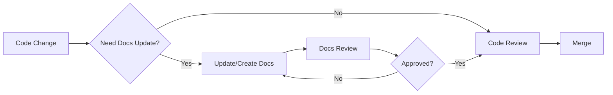

# 📚 ModernWebShop - Documentation

> **Version:** 1.0.0  
> **Last Updated:** October 30, 2025  
> **Maintainer:** Development Team

## 📖 Giới Thiệu

Đây là tài liệu kỹ thuật chi tiết cho dự án **ModernWebShop** - một hệ thống e-commerce được xây dựng trên Laravel 11/12.

Documentation này được thiết kế để:
- ✅ Giúp dev mới onboard nhanh chóng
- ✅ Hiểu rõ business logic và technical flow
- ✅ Maintain và scale hệ thống dễ dàng
- ✅ Troubleshoot và debug hiệu quả

---

## 🗂️ Cấu Trúc Documentation

```
docs/
├── README.md                          ← Bạn đang ở đây
├── ARCHITECTURE.md                    ← Kiến trúc tổng thể hệ thống
├── GETTING_STARTED.md                 ← Hướng dẫn setup cho dev mới
├── CONTRIBUTING.md                    ← Quy tắc đóng góp code
├── CHANGELOG.md                       ← Lịch sử thay đổi
│
├── guides/                            ← Hướng dẫn chung
│   ├── coding-standards.md
│   ├── database-conventions.md
│   ├── api-design-guidelines.md
│   ├── testing-strategy.md
│   └── deployment-guide.md
│
├── modules/                           ← Docs theo từng module
│   ├── product/
│   │   ├── README.md                 ← Tổng quan module Product
│   │   ├── database-schema.md
│   │   ├── api-endpoints.md
│   │   └── features/
│   │       ├── view-tracking.md
│   │       ├── inventory-management.md
│   │       └── pricing-rules.md
│   │
│   ├── user/
│   │   ├── README.md
│   │   ├── database-schema.md
│   │   └── features/
│   │       ├── authentication.md
│   │       ├── profile-management.md
│   │       └── oauth-integration.md
│   │
│   ├── order/
│   │   ├── README.md
│   │   ├── database-schema.md
│   │   └── features/
│   │       ├── order-processing.md
│   │       ├── order-status-flow.md
│   │       └── refund-handling.md
│   │
│   ├── payment/
│   │   ├── README.md
│   │   └── features/
│   │       ├── payment-gateway-integration.md
│   │       └── payment-security.md
│   │
│   └── notification/
│       ├── README.md
│       └── features/
│           ├── email-notification.md
│           └── push-notification.md
│
└── templates/                         ← Templates để tạo docs mới
    ├── module-readme-template.md
    ├── feature-doc-template.md
    └── api-endpoint-template.md
```

---

## 🚀 Quick Start

### Cho Dev Mới

1. **Đọc tài liệu cơ bản:**
   - [Getting Started Guide](./GETTING_STARTED.md)
   - [Architecture Overview](./ARCHITECTURE.md)
   - [Coding Standards](./guides/coding-standards.md)

2. **Setup môi trường:**
   ```bash
   # Clone repo
   git clone https://github.com/dqhuy2005/ModernWebShop.git
   
   # Setup backend
   cd backend
   composer install
   cp .env.example .env
   php artisan key:generate
   php artisan migrate --seed
   
   # Đọc deployment guide để biết thêm chi tiết
   ```

3. **Chọn module để học:**
   - Bắt đầu với [Product Module](./modules/product/README.md) (phổ biến nhất)
   - Hoặc [User Module](./modules/user/README.md) (authentication & authorization)

### Cho Senior Dev

- 📋 [Architecture Overview](./ARCHITECTURE.md) - Hiểu tổng quan kiến trúc
- 🔧 [Contributing Guide](./CONTRIBUTING.md) - Quy trình review và merge code
- 📊 [Testing Strategy](./guides/testing-strategy.md) - Unit test & Integration test

---

## 📦 Modules Overview

| Module | Description | Status | Docs |
|--------|-------------|--------|------|
| **Product** | Quản lý sản phẩm, view tracking, inventory | ✅ Complete | [Docs](./modules/product/README.md) |
| **User** | Authentication, profile, OAuth | ✅ Complete | [Docs](./modules/user/README.md) |
| **Order** | Xử lý đơn hàng, order flow | ✅ Complete | [Docs](./modules/order/README.md) |
| **Payment** | Payment gateway integration | 🚧 In Progress | [Docs](./modules/payment/README.md) |
| **Cart** | Shopping cart management | ✅ Complete | [Docs](./modules/cart/README.md) |
| **Category** | Category hierarchy | ✅ Complete | [Docs](./modules/category/README.md) |
| **Notification** | Email, SMS, push notifications | 🚧 In Progress | [Docs](./modules/notification/README.md) |

**Chú thích:**
- ✅ Complete: Docs đầy đủ, code production-ready
- 🚧 In Progress: Đang phát triển hoặc docs chưa đầy đủ
- 📝 Planned: Chưa implement

---

## 🔍 Tìm Kiếm Nhanh

### Theo Use Case

**"Tôi muốn hiểu cách tracking product views"**
→ [Product View Tracking](./modules/product/features/view-tracking.md)

**"Tôi muốn implement payment gateway mới"**
→ [Payment Gateway Integration](./modules/payment/features/payment-gateway-integration.md)

**"Tôi muốn hiểu order status flow"**
→ [Order Status Flow](./modules/order/features/order-status-flow.md)

**"Tôi muốn tích hợp OAuth provider mới"**
→ [OAuth Integration](./modules/user/features/oauth-integration.md)

### Theo Technical Topic

| Topic | Document |
|-------|----------|
| Database Design | [Database Conventions](./guides/database-conventions.md) |
| API Design | [API Guidelines](./guides/api-design-guidelines.md) |
| Event/Listener Pattern | [Product View Tracking](./modules/product/features/view-tracking.md) |
| Queue System | [Product View Tracking](./modules/product/features/view-tracking.md) |
| Service Layer Pattern | Multiple feature docs |
| Repository Pattern | [Architecture Overview](./ARCHITECTURE.md) |

---

## 📝 Document Conventions

### Markdown Style Guide

1. **Headings:**
   - H1 (`#`) - Title của document
   - H2 (`##`) - Main sections
   - H3 (`###`) - Sub-sections
   - H4 (`####`) - Detail points

2. **Code Blocks:**
   ```php
   // Luôn specify language
   // Có comments giải thích
   ```

3. **Mermaid Diagrams:**
   - Dùng cho flow diagrams
   - Dùng cho sequence diagrams
   - Dùng cho ER diagrams

4. **Cross References:**
   - Dùng relative paths: `[Link](../other-module/README.md)`
   - Anchor links: `[Section](#section-name)`

### Version Control

Mỗi file docs có version history ở đầu file:

```markdown
> **Version:** 1.2.0  
> **Last Updated:** October 30, 2025  
> **Author:** @dqhuy2005  
> **Reviewers:** @reviewer1, @reviewer2
```

### Change Log Format

```markdown
## Changelog

### [1.2.0] - 2025-10-30
#### Added
- New feature: Inventory management

#### Changed
- Update view tracking flow with better caching

#### Fixed
- Fix anti-spam logic bug
```

---

## 🤝 Contributing to Documentation

Khi thêm feature mới hoặc update code:

1. **Update docs trước khi merge code**
2. **Follow templates** trong `docs/templates/`
3. **Add mermaid diagrams** cho flow phức tạp
4. **Cross-reference** với docs liên quan
5. **Request docs review** cùng với code review

### Quy trình Update Docs



### Template Usage

```bash
# Tạo docs cho module mới
cp docs/templates/module-readme-template.md docs/modules/new-module/README.md

# Tạo docs cho feature mới
cp docs/templates/feature-doc-template.md docs/modules/product/features/new-feature.md
```

---

## 🎯 Best Practices

### DO ✅

- **Viết docs song song với code** - Không để sau
- **Dùng diagrams** - 1 diagram = 1000 words
- **Có examples thực tế** - Copy-paste được
- **Explain WHY** - Không chỉ HOW
- **Keep it updated** - Review docs định kỳ
- **Cross-reference** - Link tới docs liên quan

### DON'T ❌

- ❌ Viết docs quá dài, khó đọc
- ❌ Docs không sync với code
- ❌ Thiếu examples
- ❌ Không có diagrams cho flow phức tạp
- ❌ Hardcode values (dùng placeholders)
- ❌ Copy-paste code mà không explain

---

## 📞 Support & Feedback

### Nếu Docs Chưa Rõ

1. **Tạo GitHub Issue** với label `documentation`
2. **Tag người maintain** module đó
3. **Đề xuất improvements**

### Documentation Maintainers

| Module | Maintainer | Contact |
|--------|-----------|---------|
| Product | @dqhuy2005 | Email |
| User | @dqhuy2005 | Email |
| Order | @dqhuy2005 | Email |
| Payment | TBD | - |

---

## 📚 External Resources

- [Laravel Documentation](https://laravel.com/docs)
- [Laravel Best Practices](https://github.com/alexeymezenin/laravel-best-practices)
- [PHP The Right Way](https://phptherightway.com/)
- [REST API Design](https://restfulapi.net/)
- [Mermaid Diagram Syntax](https://mermaid.js.org/intro/)

---

## 📜 License

Internal documentation for ModernWebShop project.  
© 2025 ModernWebShop Team. All rights reserved.

---

**🎉 Happy Coding!**

_Last updated: October 30, 2025_
