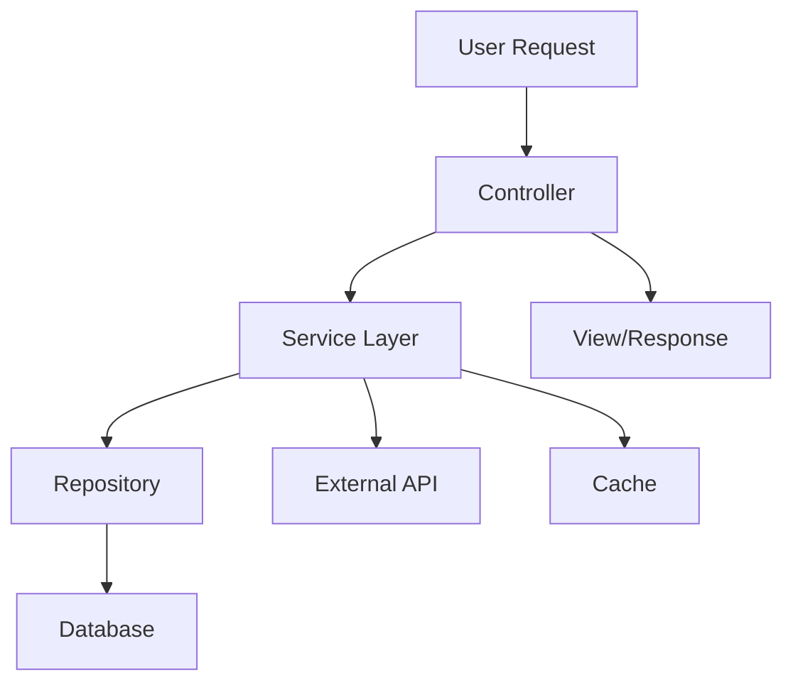
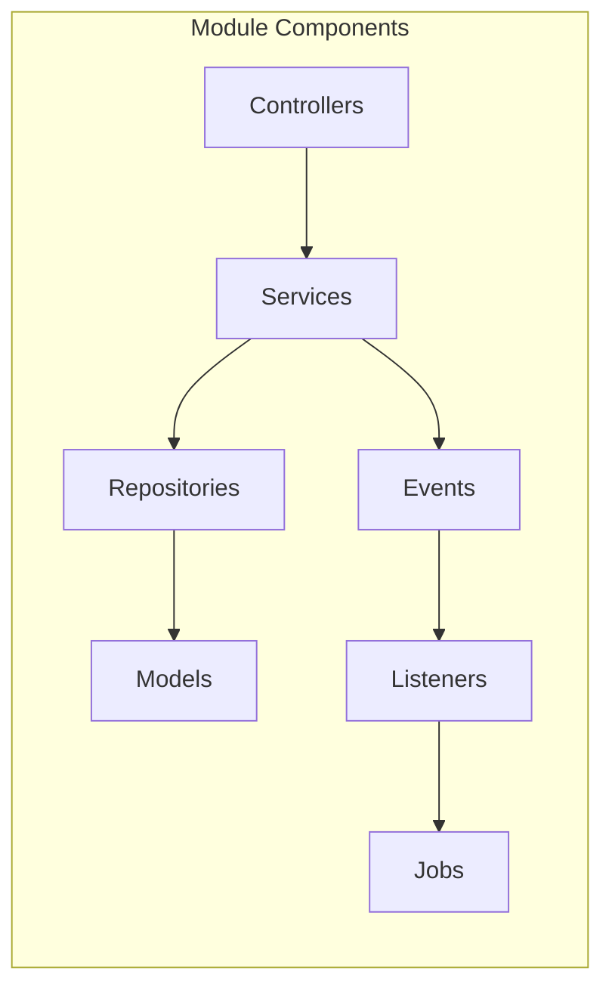
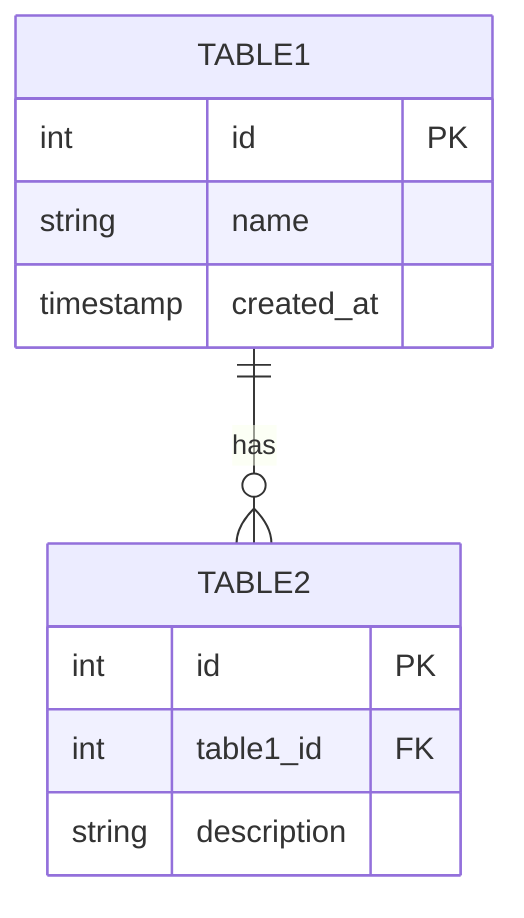
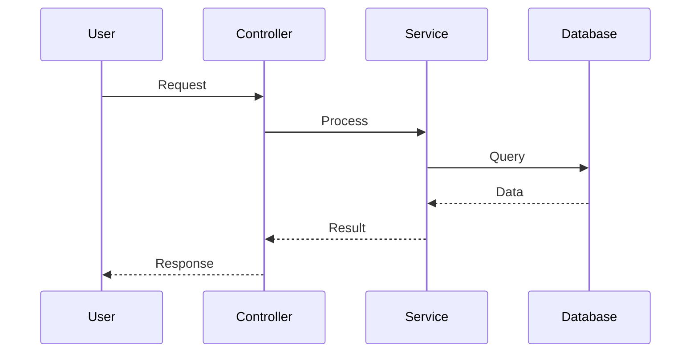

# [Module Name] - Overview

> **Version:** 1.0.0  
> **Last Updated:** YYYY-MM-DD  
> **Author:** @username  
> **Status:** ✅ Complete / 🚧 In Progress / 📝 Planned

---

## 📖 Table of Contents

- [Overview](#overview)
- [Business Context](#business-context)
- [Architecture](#architecture)
- [Database Schema](#database-schema)
- [Key Features](#key-features)
- [API Endpoints](#api-endpoints)
- [Dependencies](#dependencies)
- [Configuration](#configuration)
- [Testing](#testing)
- [Troubleshooting](#troubleshooting)
- [Changelog](#changelog)

---

## 🎯 Overview

### Purpose

[Mô tả ngắn gọn mục đích của module này - 2-3 câu]

### Scope

**Trong scope của module:**
- ✅ Feature 1
- ✅ Feature 2
- ✅ Feature 3

**Ngoài scope (handled by other modules):**
- ❌ Feature A → See [Other Module](../other-module/README.md)
- ❌ Feature B → See [Another Module](../another-module/README.md)

### Key Metrics

| Metric | Value | Target |
|--------|-------|--------|
| API Response Time | XXms | < 200ms |
| Database Queries | X queries/request | < 5 |
| Cache Hit Rate | XX% | > 80% |
| Test Coverage | XX% | > 80% |

---

## 💼 Business Context

### Business Requirements

1. **Requirement 1:**
   - Description: [Mô tả yêu cầu]
   - Priority: High/Medium/Low
   - Stakeholder: [Ai request]

2. **Requirement 2:**
   - Description: [Mô tả yêu cầu]
   - Priority: High/Medium/Low
   - Stakeholder: [Ai request]

### User Stories

```
As a [user type],
I want to [action],
So that [benefit/value].
```

**Example:**
```
As a customer,
I want to view product details and reviews,
So that I can make informed purchase decisions.
```

### Business Rules

1. **Rule 1:** [Describe business rule]
   - Exception: [When this rule doesn't apply]
   - Impact: [What happens if violated]

2. **Rule 2:** [Describe business rule]
   - Exception: [When this rule doesn't apply]
   - Impact: [What happens if violated]

---

## 🏗️ Architecture

### High-Level Architecture



### Component Diagram



### Directory Structure

```
app/
├── Http/
│   └── Controllers/
│       └── [Module]Controller.php
├── Services/
│   └── [Module]Service.php
├── Repository/
│   └── [Module]Repository.php
├── Models/
│   └── [Model].php
├── Events/
│   └── [Module]Event.php
├── Listeners/
│   └── [Module]Listener.php
└── Jobs/
    └── [Module]Job.php
```

### Design Patterns Used

- **Pattern 1:** [Pattern name and purpose]
- **Pattern 2:** [Pattern name and purpose]
- **Pattern 3:** [Pattern name and purpose]

---

## 💾 Database Schema

### Tables Overview

| Table | Purpose | Relationships |
|-------|---------|---------------|
| `table_name` | [Purpose] | Related to: `other_table` |

### Entity Relationship Diagram



### Table Details

#### `table_name`

**Purpose:** [Describe purpose]

**Columns:**
| Column | Type | Null | Default | Description |
|--------|------|------|---------|-------------|
| `id` | BIGINT | NO | AUTO | Primary key |
| `name` | VARCHAR(255) | NO | - | [Description] |
| `status` | ENUM | NO | 'active' | [Description] |
| `created_at` | TIMESTAMP | NO | CURRENT | [Description] |

**Indexes:**
- PRIMARY: `id`
- INDEX: `idx_status` on `status`
- UNIQUE: `unique_name` on `name`

**Foreign Keys:**
- `fk_parent` → `parent_table(id)` ON DELETE CASCADE

### Migration Files

- `YYYY_MM_DD_XXXXXX_create_table_name_table.php`
- `YYYY_MM_DD_XXXXXX_add_column_to_table.php`

For detailed schema, see: [database-schema.md](./database-schema.md)

---

## ✨ Key Features

### Feature List

1. **[Feature 1 Name](./features/feature-1.md)**
   - Description: [Brief description]
   - Status: ✅ Complete
   - Priority: High

2. **[Feature 2 Name](./features/feature-2.md)**
   - Description: [Brief description]
   - Status: 🚧 In Progress
   - Priority: Medium

3. **[Feature 3 Name](./features/feature-3.md)**
   - Description: [Brief description]
   - Status: 📝 Planned
   - Priority: Low

### Feature Flow Overview



---

## 🔌 API Endpoints

### Endpoint List

| Method | Endpoint | Description | Auth Required |
|--------|----------|-------------|---------------|
| GET | `/api/resource` | List resources | ✅ Yes |
| GET | `/api/resource/{id}` | Get single resource | ✅ Yes |
| POST | `/api/resource` | Create resource | ✅ Yes |
| PUT | `/api/resource/{id}` | Update resource | ✅ Yes |
| DELETE | `/api/resource/{id}` | Delete resource | ✅ Yes |

### Example Requests

#### GET /api/resource

**Request:**
```http
GET /api/resource?page=1&limit=20
Authorization: Bearer {token}
```

**Response:**
```json
{
  "data": [
    {
      "id": 1,
      "name": "Resource Name",
      "created_at": "2025-10-30T00:00:00Z"
    }
  ],
  "meta": {
    "current_page": 1,
    "total": 100
  }
}
```

For detailed API documentation, see: [api-endpoints.md](./api-endpoints.md)

---

## 🔗 Dependencies

### Internal Dependencies

| Module | Purpose | Link |
|--------|---------|------|
| [Module A](../module-a/README.md) | [Purpose] | Link |
| [Module B](../module-b/README.md) | [Purpose] | Link |

### External Dependencies

| Package | Version | Purpose |
|---------|---------|---------|
| `vendor/package` | ^1.0 | [Purpose] |

### Service Dependencies

- **Database:** MySQL 8.0+
- **Cache:** Redis 6.0+
- **Queue:** Laravel Queue (Database/Redis)

---

## ⚙️ Configuration

### Environment Variables

```env
# Module Configuration
MODULE_ENABLED=true
MODULE_CACHE_TTL=3600
MODULE_QUEUE_ENABLED=true
```

### Config Files

**config/module.php**
```php
return [
    'enabled' => env('MODULE_ENABLED', true),
    'cache_ttl' => env('MODULE_CACHE_TTL', 3600),
    'queue_enabled' => env('MODULE_QUEUE_ENABLED', true),
];
```

---

## 🧪 Testing

### Test Coverage

| Type | Coverage | Target |
|------|----------|--------|
| Unit Tests | XX% | > 80% |
| Feature Tests | XX% | > 70% |
| Integration Tests | XX% | > 60% |

### Running Tests

```bash
# Run all module tests
php artisan test --filter=Module

# Run specific test class
php artisan test tests/Feature/ModuleTest.php

# Run with coverage
php artisan test --coverage --min=80
```

### Test Files

- `tests/Unit/Services/ModuleServiceTest.php`
- `tests/Feature/ModuleControllerTest.php`

---

## 🐛 Troubleshooting

### Common Issues

#### Issue 1: [Issue Name]

**Symptoms:**
- [Describe what user sees]

**Cause:**
- [Root cause]

**Solution:**
```bash
# Steps to fix
```

**Prevention:**
- [How to prevent]

#### Issue 2: [Issue Name]

**Symptoms:**
- [Describe what user sees]

**Cause:**
- [Root cause]

**Solution:**
```bash
# Steps to fix
```

### Debug Mode

```bash
# Enable debug logging
LOG_LEVEL=debug

# Check logs
tail -f storage/logs/laravel.log
```

---

## 📋 Checklist for Developers

### Before Starting Development

- [ ] Read this README completely
- [ ] Understand business requirements
- [ ] Review related modules: [List]
- [ ] Setup local environment
- [ ] Run existing tests successfully

### During Development

- [ ] Follow coding standards
- [ ] Write unit tests (>80% coverage)
- [ ] Write feature tests
- [ ] Add inline documentation
- [ ] Update this documentation

### Before Submitting PR

- [ ] All tests passing
- [ ] Code reviewed by peer
- [ ] Documentation updated
- [ ] No breaking changes (or documented)
- [ ] Performance impact assessed

---

## 📝 Changelog

### [1.0.0] - 2025-10-30

#### Added
- Initial module implementation
- Feature 1
- Feature 2

#### Changed
- N/A

#### Fixed
- N/A

#### Deprecated
- N/A

---

## 📚 Additional Resources

### Internal Links
- [Architecture Overview](../../ARCHITECTURE.md)
- [Coding Standards](../../guides/coding-standards.md)
- [Testing Strategy](../../guides/testing-strategy.md)

### External Links
- [Laravel Documentation](https://laravel.com/docs)
- [Package Documentation](https://example.com)

---

## 👥 Contributors

| Name | Role | Contact |
|------|------|---------|
| @username | Module Owner | email@example.com |
| @username2 | Contributor | email2@example.com |

---

## 📞 Support

For questions or issues:
1. Check [Troubleshooting](#troubleshooting) section
2. Search existing GitHub issues
3. Create new issue with label `module:[module-name]`
4. Contact module owner: @username

---

**Last Updated:** YYYY-MM-DD  
**Next Review:** YYYY-MM-DD
